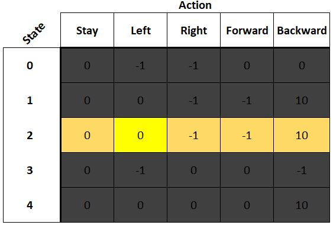
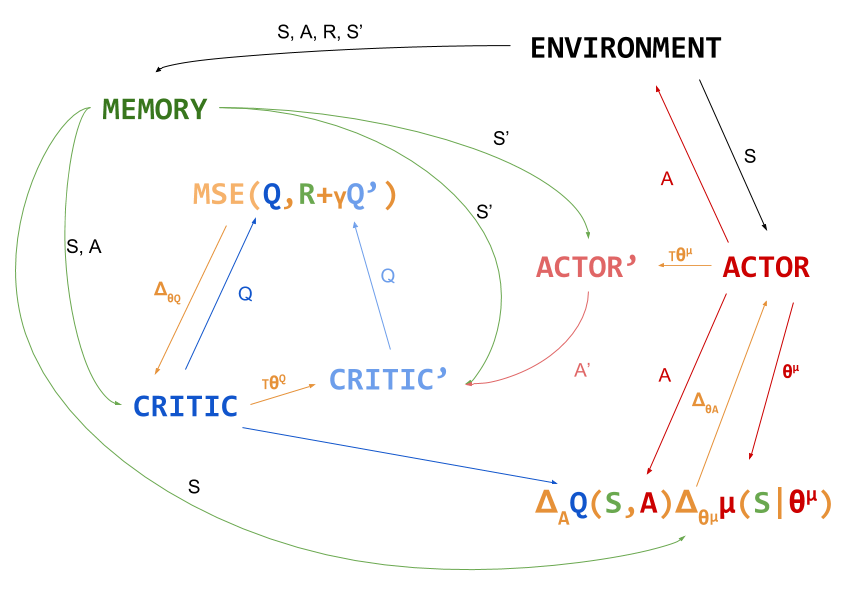
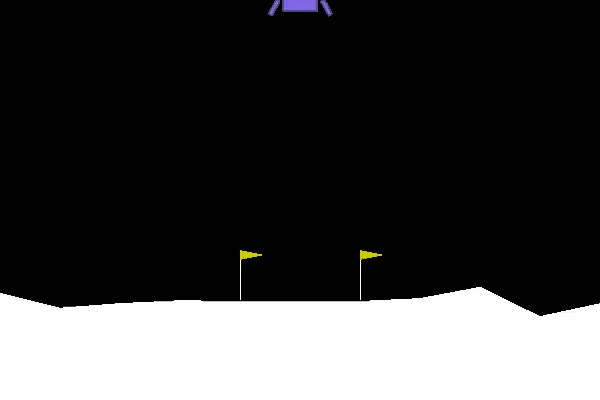

% Continuous Control with Deep Deterministic Policy Gradients
% John Berroa, Felix Meyer zu Driehausen, Alexander Höreth
% University of Osnabrück, \today

# Introduction
With the *Deep Deterministic Policy Gradient*, or DDPG, we want to be able to train an artifical agent through reinforcement learning how to act in an environment in which the actions are on a continuous scale.  Some examples applications of this would be car racing (e.g. steering, gas pressure, brake pressure) and games (e.g. Lander).  Continuous control reinforcement learning brings reinforcement learning out of the realm of toy applications and the theoretical and brings it into the continuous world of reality.  To do this, however, requires a more complex approach than normal reinforcement learning.  Below we will outline the idea behind DDPG.

## Q-Learning
Reinforcement learning allows an artifical agent to learn a task without being provided with labels, but instead reward which hints at the proper action to take.  Put very simply, the agent wants to repeat the actions that give highest reward.  The classic reinforcement learning approach, *Q-Learning*, creates a table of State-Action value pairs over many iterations of the agent running through the task, called *episodes*.  This table is then used to pick actions: when in a particular state, the actor picks the action that has the highest "Q-value," which if the agent has learned the task properly, will be the most optimal action to take given that state.  Q-learning can be abstracted into an artificial neural network to create a neural representation of this Q-table.  This is called *Deep Q Network*, or DQN.  DQN has been used in a variety of applications, most notably Atari games.

## Continuous Actions
However, the downfall of DQN and Q-learning is that actions are discrete.  Imagine trying to drive a car, and the goal in a particular state is to avoid a crash.  The wheel must be turned $50^\circ$ (or more) to avoid the obstacle.  A discrete action space such as **Left/Right** might not be enough of a turn to survive.  Discretizing the wheel into $5^\circ$ increments might work, but leads to a combinatorial explosion, as well as not allowing all the degrees of turn in between.  This problem compounds and ultimately leads to the realization that Q-learning is insufficient for continuous actions because of the table representation.  The table would need to be infinitely long in the *Action* axis, and to take the $\textrm{max}$ of an infinite series of numbers is impossible.  On the bright side, continuous actions gives us a policy gradient, and when there's a gradient, there's the ability to optimize.  In this case, maximization is what we want because we want to maximize our future reward.  If we maximize this policy gradient, we will be able to learn continuous actions in reinforcement learning.

The following sections will be laid out as follows: first, we will describe in detail the theoretical basis of DDPG; second, we will discuss how to train DDPG in code with the racing game TORCS, and also how to get the TORCS environment installed; lastly, we will conclude the paper with some comments.

{width=50%}

# Theoretical Basis
Policy gradient methods are an estabished branch of reinforcement learning techniques that try to optimize a parameterized policy with respect to its long term cumulative reward. Foundational work for the deep determinictic policy algorithm that we are presenting here was laid over the last decades. In the following, we will very briefly present how  policy gradient methods evolved towards DDPG. Therefore we refer to @Sutton2000 for policy gradients in general, @Silver2014 for the deterministic policy gradient, and finally @Lillicrap2015 for deep deterministic policy gradients.

## Policy Gradient
The core of every policy gradient method is to optimize the policy, through changing its parameters. In order to optimize, one needs a measurement of the performance of a particular policy. In an episodic environment with a clearly defined start state, the goodness of the policy is the cumulative reward gained when coming from the start state. The performance objective can be written as
$$ J_1(\theta)  = \mathbb{E_\pi}(R_{t+1}+\gamma R_{t+2}+\gamma^2R_{t+3}+...|S_t) $$
where $\theta$ is the set of parameters of the policy $\pi$. In words, the performance objective is the expected, and by $\gamma$ discounted reward over a trajectory of future states. Taking this into account, our goal can be more clearly defined as finding the gradient of the performance objective with respect to $\theta$. This gradient would allow us to change $\theta$ in order to maximize the performance objective.

A whole trajcetory of states is a sequence of states $s$, actions $a$ and rewards $r$, for example: $\tau = (s_0 , a_0 , r_0 , s_1 , a_1 , r_1 , ... , s_{T-1} , a_{T-1} , r_{T-1} , s_T )$ Then, the gradient with respect to parameters $\theta$ of the expected return of trajectory $\tau$ can be expressed as
$$ \nabla_{\theta} \mathbb{E}_{\tau} [R(\tau)] = \mathbb{E}_{\tau} [\nabla_{\theta} \log \, p(\tau | \theta) R(\tau)] $$
This expression follows directly from the performance objective (score function) and the definiton of expectation.  We refer to a nice illustration of this relation in a blog post by Andrej Karpathy[^karpathy] for a stepwise explanation.

[^karpathy]: [http://karpathy.github.io/2016/05/31/rl/](http://karpathy.github.io/2016/05/31/rl/)

Under the markov assumption we can detail $p(\tau | \theta)$ into a product of terms corresponding to a timestep within the trajectory each:
$$ p(\tau | \theta) = \prod_{t=0}^{T-1} \left[ \pi(a_t | s_t , \theta) P(s_{t+1} , r_t | s_t , a_t) \right] $$
Here, $\pi(a_t | s_t , \theta)$ is the (stochastic) policy, giving a distribution over actions depending on the current state $s_t$ and the parameter set $\theta$. $P(s_{t+1} , r_t | s_t , a_t)$ is the state transition probability distribution, which is detailing probabilities for each state-state transition pair.

As we are aiming to estimate $\nabla_{\theta} \log \, p(\tau | \theta)$, taking $\log \, p(\tau | \theta)$ transforms the product into a sum. Further, the gradient $\nabla_{\theta}$ is not dependent on $P(s_{t+1} , r_t | s_t , a_t)$. Therefore the policy gradient simplifies to
$$ \nabla_{\theta} \mathbb{E}_{\tau}[R] = \mathbb{E}_{\tau}[ R \nabla_{\theta}  \sum_{t=0}^{T-1} [\log \, \pi(a_t | s_t , \theta)] ]$$

 When using the state-action value function $Q^{\pi}$ for $R$ the policy gradient is:
$$ \nabla_{\theta} \mathbb{E}_{\tau}[R] = \mathbb{E}_{\tau} [ \sum_{t=0}^{T-1} \nabla_{\theta} \log \, \pi(a_t | s_t , \theta) Q^{\pi}(s_t,a_t) ]$$

@Sutton2000

So far we have introduced the stochastic policy gradient. The deterministic policy gradient was proven to exist more recently by @Silver2014. As mentioned above, the deterministic policy gradient is essential for solving continuous control problems. The deterministic policy gradient is mathematically a special case of the stochastic policy gradient and, in first impression, also looks quite different. A thourough derivation can be found in @Silver2014, which builds upon the beforementioned ideas behind the stochastic policy gradient. Further, we provide some more information on how to apply the deterministic policy gradient in our notebook on Lunar Lander.[^lander]

## Deep Deterministic Policy Gradient
The deep deterministic policy gradient, as introduced by @Lillicrap2015, addresses the problem of estimating $Q^{\pi}$ by using deep neural networks. As these estimators on their own simply fulfill a role in the reinforcement learning framework, we describe them in the more application oriented notebook for Lunar Lander (see next section).

# Implementation

{#fig:ddpgmodel width=50%}

## Tutorial
Because of the complexity of the employed neural network (which is basically four networks, see Figure \ref{fig:ddpgmodel}), we provide an extensively documented and interactive tutorial. The tutorial guides the user through a complete implementation of the DDPG algorithm applied to the Lunar Lander (see Figure \ref{fig:lander}) environment from the OpenAI Gym [@Brockman2016].[^lander]

{#fig:lander width=50%}

Additionally, targeted for those new to reinforcement learning in general, we provide a notebook all around tabular Q-learning solving the classical Frozen Lake game. In frozen lake one has to control an agent over a small map from start to goal. The challenge is, that the environment is non deterministic: At each step there is a 33% chance of slipping and moving orthogonally to the originally executed action.

The notebook implements three algorithms: Q-Learning as taught in the Institute of Cognitive Science's Machine Learning lecture on the deterministic game (meaning there is no slippery ice because the algorithm is unable to solve it otherwise), Q-Learning itself and the classical, non-greedy SARSA algorithm.

The difference between Q-Learning and SARSA in short is that Q-Learning greedily chooses the maximum future Q value for the Bellman equation approximation while SARSA (which fittingly is an abbreviation for *S*tate, *A*ction, *R*eward, *S*tate, *A*ction) uses the current policy for that estimation. For more details, see the notebook.[^lake]

[^lander]: [github.com/ahoereth/ddpg $\rightarrow$ exploration/Lander.ipynb](https://github.com/ahoereth/ddpg/blob/master/exploration/Lander.ipynb)
[^lake]: [github.com/ahoereth/ddpg $\rightarrow$ exploration/FrozenLake.ipynb](https://github.com/ahoereth/ddpg/blob/master/exploration/FrozenLake.ipynb)

## DDPG
The actual implementation we applied to torcs is more sophisticated than the one in the notebook, but holds all the same ideas. The general approach was to have a generalizable foundation for deep reinforcement learning algorithms in general, which lead to quite a bit of abstraction. We provide a set of classes which interact with one another and are capable of very generally tackle all problems which follow the API schema put forward by the Open AI Gym.

A user implementing an algorithm like DDPG[^ddpg] only needs to create a single class inheriting from `model`[^modelclass] and stick to the interface put forward by it. Another implementation of this concept for the DQN algorithm is planned, but not yet completed.

Behind the scenes the model class will take care of threaded experience generation with multiple agents and multithreaded feeding of data to and training of the Tensorflow network. Performance gains of this approach for normally not asynchronous algorithms like DDPG and DQN will need to be investigated and were out of the scope of this project.

To use the implemented algorithm one should take a look at the README[^readmemd] file and the `run.py`[^runpy] and `torcs.py`[^torcspy] -- the latter two files should be self explanatory and need to be edited for hyperparameter tuning.

[^ddpg]: [github.com/ahoereth/ddpg $\rightarrow$ src/ddpg.ipynb](https://github.com/ahoereth/ddpg/blob/master/src/ddpg.py)
[^modelclass]: [github.com/ahoereth/ddpg $\rightarrow$ src/lib/model.ipynb](https://github.com/ahoereth/ddpg/blob/master/src/lib/model.py)
[^readmemd]: [github.com/ahoereth/ddpg $\rightarrow$ README.md](https://github.com/ahoereth/ddpg)
[^runpy]: [github.com/ahoereth/ddpg $\rightarrow$ run.py](https://github.com/ahoereth/ddpg/blob/master/src/lib/model.py)
[^torcspy]: [github.com/ahoereth/ddpg $\rightarrow$ torcs.py](https://github.com/ahoereth/ddpg/blob/master/src/lib/model.py)

{width=50%}

# Conclusion
As mentioned in the introduction, continuous action reinforcement learning allows us to tackle a lot more applications which are closer to the real world. The DDPG paper was huge when it came out, and most reinforcement learning papers these days reference it or some derived work in some way. Nevertheless, when applying the algorithm to any problem at all we always came back to a single (for nearly all Deep RL algorithms) well known challenge: The amount of data required for learning reasonable policies. In prior projects some of us already ran into similar problems with the DQN algorithm and also for algorithms succeeding DDPG and exceeding it performance wise this is ongoing.

As viewable in the repository[^repo] our algorithm learns a reasonable policy, but fails to complete a whole track. Training to achieve this policy on a consumer grade quad core machine takes around half a day, further progress is to be expected.

[^repo]: [https://github.com/ahoereth/ddpg](https://github.com/ahoereth/ddpg)

## References {.allowframebreaks}

\footnotesize

